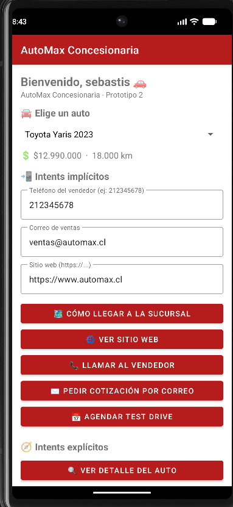
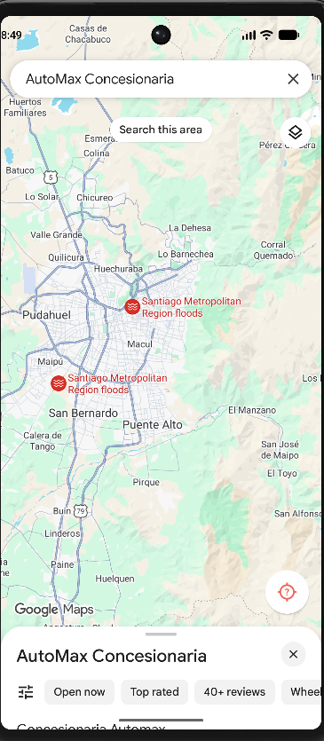
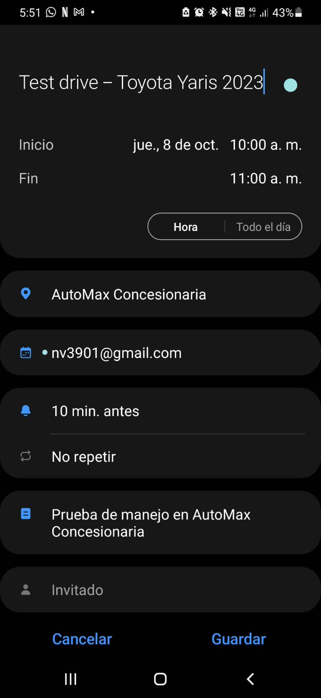

# 🚗 AutoMax Concesionaria - Prototipo 2

App Android hecha en **Java** para el ramo **Programación Android** (Instituto Profesional Santo Tomás).
Es la app de una concesionaria de autos: puedes elegir un auto del catálogo, ver su detalle, pedir una cotización, llamar al vendedor, agendar un test drive y más.
En este prototipo practicamos los **intents implícitos y explícitos**, o sea, cómo abrir otras apps del celular y cómo movernos entre las pantallas de nuestra propia app. También agregamos **validaciones** para que el usuario no mande datos malos. ✅

👥 **Integrantes:** _(poner aquí los nombres del grupo)_
🏫 **Ramo:** Programación Android
📝 **Actividad:** Prototipo 2 (sumativa 15%)

> ℹ️ Los autos, precios, teléfono, correo y página web son **datos de ejemplo** inventados para el trabajo.

---

## 🛠️ Versiones

| Cosa | Versión |
|------|---------|
| Android Gradle Plugin (AGP) | 8.5.2 |
| Gradle | 8.7 |
| compileSdk / targetSdk | 34 (Android 14) |
| minSdk | 24 (Android 7.0) |
| Lenguaje | Java 8 |
| Librerías | AppCompat, Material Components, ConstraintLayout |

---

## 📲 Intents implícitos (5)

Estos abren otras apps del teléfono. Ninguno necesita permisos peligrosos. 🔓

| # | Intent | Acción usada | Cómo probarlo |
|---|--------|--------------|---------------|
| 1 | 🗺️ Cómo llegar a la sucursal | `ACTION_VIEW` con `geo:lat,lng?q=texto` | Apretar **Cómo llegar a la sucursal**. Se abre Google Maps con la sucursal marcada. |
| 2 | 🌐 Ver sitio web | `ACTION_VIEW` con `https://` | Dejar `https://www.automax.cl` y apretar **Ver sitio web**. Si borras el `https://` sale error. |
| 3 | 📞 Llamar al vendedor | `ACTION_DIAL` con `tel:` | Apretar **Llamar al vendedor**. Se abre el marcador con el número (no llama solo). |
| 4 | ✉️ Pedir cotización por correo | `ACTION_SENDTO` con `mailto:` | Elegir un auto y apretar **Pedir cotización por correo**. Se abre el correo con el asunto y el mensaje del auto ya escritos. |
| 5 | 📅 Agendar test drive | `ACTION_INSERT` con `Events.CONTENT_URI` | Elegir un auto y apretar **Agendar test drive**. Se abre el calendario con el evento de mañana a las 10:00 y la sucursal como lugar. |

---

## 🧭 Intents explícitos (3)

Estos nos mueven entre las pantallas de la misma app.

| # | Intent | Cómo probarlo |
|---|--------|---------------|
| 1 | 🔍 `MainActivity → DetalleActivity` (con datos extra con `putExtra`) | Elegir un auto y apretar **Ver detalle del auto**. Se muestran nombre, precio, año, kilometraje y descripción. |
| 2 | ⚙️ `MainActivity → ConfigActivity` (con botón Atrás en la barra) | Apretar **Configuración**, escribir un nombre y guardar. Al volver, el saludo de arriba cambia. |
| 3 | 📝 `FormActivity → ConfirmActivity` (con resultado, usando `registerForActivityResult()`) | Apretar **Solicitar cotización**, llenar los datos y apretar **Revisar y enviar**. En la otra pantalla elegir Confirmar o Cancelar y ver el mensaje de resultado. |

---

## ✅ Validaciones

Todas están en la clase `Validaciones.java`:

- 📞 **Teléfono:** 9 dígitos chilenos, con o sin `+56`.
- ✉️ **Correo:** formato válido (`Patterns.EMAIL_ADDRESS`).
- 🌐 **Web:** tiene que partir con `https://` y ser una dirección válida.
- 👤 **Nombre:** mínimo 3 letras.
- 💬 **Mensaje del formulario:** mínimo 10 caracteres.

Si algo está mal, el campo muestra un error en rojo y **no** se lanza el intent. 🚫

Además, cada intent implícito está dentro de un `try/catch` por si el teléfono no tiene una app para esa acción (muestra un mensaje en vez de cerrarse).

---

## 📸 Capturas

> Reemplazar estas imágenes por las capturas reales (mínimo 4) guardadas en la carpeta `capturas/`.

| Pantalla principal | Google Maps | Calendario |
|---|---|---|
|  |  |  |

| Detalle del auto | Formulario con error | Confirmación |
|---|---|---|
|  |  |  |

---

## ▶️ Cómo compilar y probar

1. Abrir la carpeta del proyecto con **Android Studio** (Hedgehog o más nuevo).
2. Esperar a que termine el **Gradle Sync**.
3. Conectar un celular con depuración USB o abrir un emulador (con Google Play para que funcionen Maps y Calendario).
4. Apretar ▶️ **Run**.

📦 **APK debug:** después de compilar queda en
`app/build/outputs/apk/debug/app-debug.apk`
(o desde el menú: *Build > Build Bundle(s) / APK(s) > Build APK(s)*).

---

## 🌿 Ramas de Git

- `main` → versión estable
- `feature/intents` → rama de trabajo donde hicimos los intents

---

## 💡 Lo que aprendimos

- La diferencia entre un intent **implícito** (le pedimos a Android que busque una app) y uno **explícito** (le decimos exactamente qué Activity abrir).
- Que `ACTION_DIAL` no necesita permiso y `ACTION_CALL` sí.
- Que `startActivityForResult` ya está obsoleto y ahora se usa `registerForActivityResult()`.
- Que siempre hay que validar los datos antes de lanzar un intent. 😅
